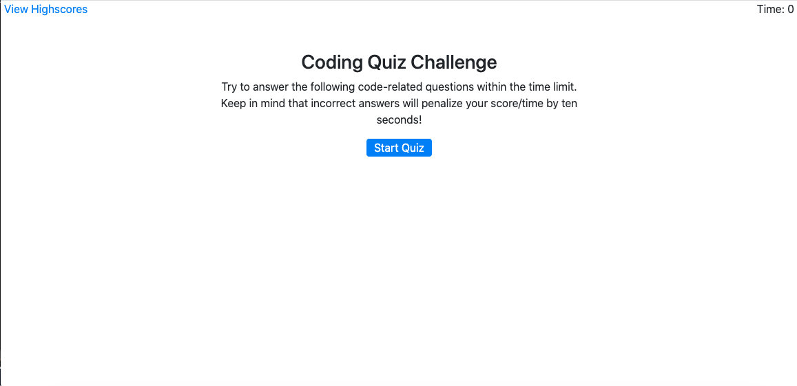

# Code-Quiz332

## Description 

For this project I have created a timed multiple choice code quiz for a juxtaposition of JavaScript review and some fun.  This app runs in the browser and features dynamically updated HTML, CSS and Bootstrap powered by JavaScript. This also features clean user interface that will adapt to multiple screen sizes. 

## Table of Contents

* [Installation](#installation)
* [Usage](#usage)
* [Credits](#credits)
* [License](#license)

## Installation

Click this link in order to take the timed JavaScript quiz:
https://cgriffin332.github.io/Code-Quiz332/#

## Usage 

When the webpage loads, the user is presented with this title page:

The code quiz begins when the start button is pressed. The timer begins and the first multiple choice quiz question is shown.

When the user clicks their answer, the user is notified if their choice was correct and the next quiz question is displayed. If the user's response is incorrect, the timer is lowered by 10 seconds.

When the user answers the final quiz question or when the timer reaches 0, the game is over. The user is shown their score and they can save their initials to the Highscore page.

You are then shown the highscores page where it lists the user's highscores.

The user can press the "clear" button to clear highscores, or can press the "go back" button to try the quiz again.

## Credits

This project was asigned to me by my Georgia Tech Bootcamp.  I used Bootstrap to help create a responsive application.

## License

MIT License

Copyright (c) [2020] [Calvin Griffin]

Permission is hereby granted, free of charge, to any person obtaining a copy
of this software and associated documentation files (the "Software"), to deal
in the Software without restriction, including without limitation the rights
to use, copy, modify, merge, publish, distribute, sublicense, and/or sell
copies of the Software, and to permit persons to whom the Software is
furnished to do so, subject to the following conditions:

The above copyright notice and this permission notice shall be included in all
copies or substantial portions of the Software.

THE SOFTWARE IS PROVIDED "AS IS", WITHOUT WARRANTY OF ANY KIND, EXPRESS OR
IMPLIED, INCLUDING BUT NOT LIMITED TO THE WARRANTIES OF MERCHANTABILITY,
FITNESS FOR A PARTICULAR PURPOSE AND NONINFRINGEMENT. IN NO EVENT SHALL THE
AUTHORS OR COPYRIGHT HOLDERS BE LIABLE FOR ANY CLAIM, DAMAGES OR OTHER
LIABILITY, WHETHER IN AN ACTION OF CONTRACT, TORT OR OTHERWISE, ARISING FROM,
OUT OF OR IN CONNECTION WITH THE SOFTWARE OR THE USE OR OTHER DEALINGS IN THE
SOFTWARE.

---